# TechXayan Creative Database Architecture & ERD Specification

## 1. Executive Summary

This document specifies the enterprise PostgreSQL relational database architecture engineered for **TechXayan Creative's `my_editor`** (Windows + Android professional video editor).

The architecture is built on five core pillars:
1. **Immutable Timeline & Project Versioning**: Project histories are never overwritten blindly. Every timeline edit and project snapshot produces an immutable version entry.
2. **Deterministic Data Integrity**: Strict foreign key constraints with cascading rules, explicit domain-level `CHECK` constraints, and automatic `updated_at` triggers.
3. **Soft-Delete Safety**: Soft deletion (`deleted_at TIMESTAMP WITH TIME ZONE`) on essential user and media assets paired with partial unique indexes to prevent accidental data loss while allowing name reuse.
4. **Sub-millisecond Query Performance**: Targeted B-Tree and GIN indexes across foreign keys, statuses, timestamps, and tags.
5. **Double-Entry Credit Accounting**: Atomic ledger tracking credit grants, holds, usage, and refunds for AI and render jobs.

---

## 2. Entity Relationship Diagram (ERD)

```mermaid
erDiagram
    %% Identity & Access
    users ||--o{ profiles : "has profile"
    users ||--o{ sessions : "maintains"
    users ||--o{ devices : "registers"
    devices ||--o{ sessions : "originates"

    %% Projects & Versioning
    users ||--o{ projects : "owns"
    projects ||--o{ project_members : "shares with"
    users ||--o{ project_members : "participates in"
    project_members ||--o{ project_permissions : "granted"
    projects ||--o{ project_versions : "historical versions"
    projects ||--|| timeline_documents : "active document"
    timeline_documents ||--o{ timeline_versions : "immutable history"
    project_versions ||--o| timeline_versions : "references"

    %% Media Assets & Variants
    users ||--o{ media_assets : "uploads"
    projects ||--o{ media_assets : "associates"
    storage_objects ||--o{ media_assets : "stores payload"
    media_assets ||--o{ media_variants : "encodes into"
    media_assets ||--|| media_metadata : "analyzed into"
    media_assets ||--o{ media_thumbnails : "previewed by"
    media_assets ||--|| media_waveforms : "visualized by"
    media_assets ||--o{ media_proxies : "scrubbed via"

    %% AI Pipeline
    users ||--o{ ai_jobs : "dispatches"
    projects ||--o{ ai_jobs : "targets"
    ai_jobs ||--o{ ai_job_steps : "executes"
    ai_jobs ||--o{ ai_outputs : "produces"
    storage_objects ||--o{ ai_outputs : "persists"

    %% Subscriptions & Credits
    plans ||--o{ subscriptions : "defines tier"
    users ||--|| subscriptions : "holds"
    users ||--|| credits : "owns wallet"
    credits ||--o{ credit_transactions : "audits ledger"

    %% Creative Assets
    users ||--o{ templates : "authors"
    storage_objects ||--o{ fonts : "files"
    storage_objects ||--o{ assets : "files"

    %% Auditing & Notifications
    users ||--o{ notifications : "receives"
    users ||--o{ audit_logs : "performed by"
```

---

## 3. Subsystem Data Dictionary

### 3.1 Identity & Device Access

#### `users`
Represents user credentials, system privileges, and security status.
- `id` (`UUID`, PK, default: `uuid_generate_v4()`)
- `email` (`CITEXT`, Unique where `deleted_at IS NULL`, Case-insensitive email)
- `password_hash` (`VARCHAR(255)`, Argon2/bcrypt password digest)
- `role` (`VARCHAR(32)`, Check: `'user' | 'pro' | 'admin' | 'system'`)
- `status` (`VARCHAR(32)`, Check: `'active' | 'suspended' | 'pending_verification' | 'deleted'`)
- `email_verified_at` (`TIMESTAMPTZ`, Nullable)
- `deleted_at` (`TIMESTAMPTZ`, Soft delete timestamp)
- `created_at` / `updated_at` (`TIMESTAMPTZ`)

#### `profiles`
User profile and application preferences.
- `id` (`UUID`, PK)
- `user_id` (`UUID`, FK -> `users.id`, Unique, Cascade Delete)
- `display_name` (`VARCHAR(100)`)
- `avatar_url` (`TEXT`)
- `bio` (`TEXT`)
- `timezone` (`VARCHAR(64)`, default: `'UTC'`)
- `locale` (`VARCHAR(16)`, default: `'en-US'`)
- `preferences` (`JSONB`, default: dark theme, auto-save interval, hardware acceleration flags)

#### `devices`
Enables cross-device synchronization between Windows desktop and Android devices.
- `id` (`UUID`, PK)
- `user_id` (`UUID`, FK -> `users.id`, Cascade Delete)
- `device_fingerprint` (`VARCHAR(255)`)
- `device_type` (`VARCHAR(32)`, Check: `'windows' | 'android' | 'web' | 'macos'`)
- `device_name` (`VARCHAR(128)`)
- `os_version` (`VARCHAR(64)`)
- `app_version` (`VARCHAR(32)`)
- `push_token` (`TEXT`)
- `last_active_at` (`TIMESTAMPTZ`)
- `is_trusted` (`BOOLEAN`, default: `TRUE`)
- *Constraint*: `UNIQUE (user_id, device_fingerprint)`

#### `sessions`
Tracks active sessions and device-linked refresh tokens.
- `id` (`UUID`, PK)
- `user_id` (`UUID`, FK -> `users.id`, Cascade Delete)
- `device_id` (`UUID`, FK -> `devices.id`, Set Null)
- `refresh_token_hash` (`VARCHAR(255)`, Unique)
- `ip_address` (`INET`)
- `user_agent` (`TEXT`)
- `expires_at` (`TIMESTAMPTZ`)
- `is_revoked` (`BOOLEAN`, default: `FALSE`)

---

### 3.2 Projects & Strict Versioning Engine

#### Why Project Data is Strictly Versioned
In video editing, users frequently make multi-track edits, perform experimental cuts, test color grades, and re-order clips. Blinding overwriting project state leads to catastrophic data loss during crashes, accidental saves, or concurrent multiplayer editing conflicts.

The schema decouples the **Project Entity** from its **Historical State**:
1. `projects` and `timeline_documents` act as stable container anchors.
2. `project_versions` and `timeline_versions` are **strictly append-only** immutable records.
3. Every manual save, commit, or auto-save inserts a new version row with an incrementing integer `version_number`.
4. Rollback to any past point in time is an O(1) pointer update pointing `active_version_id` to the target version record.

#### `projects`
- `id` (`UUID`, PK)
- `owner_id` (`UUID`, FK -> `users.id`, Restrict Delete)
- `title` (`VARCHAR(255)`)
- `description` (`TEXT`)
- `resolution_width` (`INTEGER`, Check: `> 0 AND <= 15360`)
- `resolution_height` (`INTEGER`, Check: `> 0 AND <= 8640`)
- `framerate` (`NUMERIC(6,3)`, e.g., `23.976`, `29.970`, `60.000`)
- `aspect_ratio` (`VARCHAR(16)`, default: `'16:9'`)
- `color_space` (`VARCHAR(32)`, default: `'rec709'`)
- `current_version_id` (`UUID`, FK -> `project_versions.id` deferred)
- `version_number` (`INTEGER`, current head version)
- `thumbnail_url` (`TEXT`)
- `status` (`VARCHAR(32)`, Check: `'active' | 'archived' | 'deleted'`)
- `deleted_at` (`TIMESTAMPTZ`)

#### `project_versions` (Immutable Snapshot History)
- `id` (`UUID`, PK)
- `project_id` (`UUID`, FK -> `projects.id`, Cascade Delete)
- `version_number` (`INTEGER`)
- `created_by` (`UUID`, FK -> `users.id`, Set Null)
- `change_summary` (`TEXT`)
- `snapshot_data` (`JSONB`, complete project settings, markers, export presets)
- `timeline_version_id` (`UUID`, FK -> `timeline_versions.id`, Set Null)
- `is_auto_save` (`BOOLEAN`, default: `FALSE`)
- *Constraint*: `UNIQUE (project_id, version_number)`

#### `timeline_documents`
Anchor for the multi-track timeline.
- `id` (`UUID`, PK)
- `project_id` (`UUID`, FK -> `projects.id`, Unique, Cascade Delete)
- `duration_seconds` (`NUMERIC(12,3)`)
- `framerate` (`NUMERIC(6,3)`)
- `tracks_count` (`INTEGER`)
- `active_version_id` (`UUID`, FK -> `timeline_versions.id` deferred)
- `version_counter` (`INTEGER`, monotonic counter)

#### `timeline_versions` (Immutable Multi-Track Tree History)
- `id` (`UUID`, PK)
- `timeline_id` (`UUID`, FK -> `timeline_documents.id`, Cascade Delete)
- `project_id` (`UUID`, FK -> `projects.id`, Cascade Delete)
- `version_number` (`INTEGER`)
- `author_id` (`UUID`, FK -> `users.id`, Set Null)
- `mutation_type` (`VARCHAR(64)`, e.g. `'clip_add'`, `'clip_move'`, `'clip_trim'`, `'effect_apply'`, `'auto_save'`)
- `tracks_state` (`JSONB`, full hierarchical tracks: video, audio, text, effects with clip in/out/speed)
- `markers` (`JSONB`)
- `delta_patch` (`JSONB`, optional JSON patch / OT delta against predecessor)
- *Constraint*: `UNIQUE (timeline_id, version_number)`

#### `project_members` & `project_permissions`
Multiplayer team collaboration and granular role-based capabilities.
- Role types: `'owner' | 'admin' | 'editor' | 'viewer' | 'commenter'`
- Capabilities: `can_edit_timeline`, `can_export`, `can_invite`, `can_delete_assets`, `can_manage_roles`

---

### 3.3 Media Pipeline Hierarchy

#### `storage_objects`
Single source of truth for all binary files stored in AWS S3, Cloudflare R2, or MinIO.
- `id` (`UUID`, PK)
- `bucket` (`VARCHAR(128)`)
- `key` (`TEXT`)
- `driver` (`VARCHAR(32)`, `'s3' | 'minio' | 'r2' | 'local'`)
- `size_bytes` (`BIGINT`)
- `mime_type` (`VARCHAR(128)`)
- `etag` (`VARCHAR(128)`)
- `checksum_sha256` (`VARCHAR(64)`)
- `is_public` (`BOOLEAN`)
- `status` (`VARCHAR(32)`, `'pending_upload' | 'available' | 'deleted'`)
- *Constraint*: `UNIQUE (bucket, key)`

#### `media_assets`
- `id` (`UUID`, PK)
- `user_id` (`UUID`, FK -> `users.id`)
- `project_id` (`UUID`, FK -> `projects.id` nullable)
- `storage_object_id` (`UUID`, FK -> `storage_objects.id`)
- `name` / `original_filename` (`VARCHAR(255)`)
- `duration_seconds`, `width`, `height`, `framerate`, `audio_channels`, `audio_sample_rate`
- `status` (`'uploading' | 'processing' | 'ready' | 'failed' | 'deleted'`)

#### `media_variants`, `media_metadata`, `media_thumbnails`, `media_waveforms`, `media_proxies`
- **Variants**: Encoded stems, alternate bitrates, and master renders.
- **Metadata**: Deep EXIF, FFprobe stream telemetry, color primaries, alpha channel presence.
- **Thumbnails**: Filmstrip and hover-scrub preview frames indexed by `time_offset_seconds`.
- **Waveforms**: Pre-computed audio amplitude peak arrays (`peaks_data JSONB`) enabling instant 60fps timeline audio wave drawing without client decoding.
- **Proxies**: Lightweight edit proxies (`360p`, `720p`, `1080p` ProRes / H.264) for smooth timeline scrubbing on low-powered Android tablets and laptops.

---

### 3.4 AI Distributed Jobs & Steps

- `ai_jobs`: High-level tasks (`transcription`, `caption_generation`, `smart_cut`, `broll_generation`, `voice_enhancement`).
- `ai_job_steps`: Real-time sub-stage tracking with individual status, progress percentage (0-100), and diagnostics.
- `ai_outputs`: Output payloads (SRT subtitles, JSON word-level timestamps, silence cut markers, synthetic media assets).

---

### 3.5 Billing, Plans & Double-Entry Credits

- `plans`: Feature tiers (`Free`, `Pro`, `Studio`, `Enterprise`) with pricing, export resolution ceilings, and cloud storage quotas.
- `subscriptions`: Stripe-synchronized recurring status (`active`, `trialing`, `past_due`, `canceled`).
- `credits`: Real-time wallet balance protected by strict DB check `CHECK (balance >= 0)`.
- `credit_transactions`: Immutable double-entry ledger auditing every credit allocation, deduction, and automated failure refund.

---

### 3.6 Creative Assets Catalog

- `templates`: Project scaffolds categorized by platform (`youtube`, `tiktok`, `cinematic`, `podcast`).
- `effects`: Parameterized shaders, LUTs, and color grades.
- `transitions`: Video transitions with customizable duration and curve dynamics.
- `fonts`: Open-source and custom typography for subtitles and titles.
- `assets`: Stock music, sound effects, motion stickers, and overlays.

---

### 3.7 System Auditing & Notifications

- `notifications`: User notifications (`job_completed`, `collaboration_invite`, `credit_low`).
- `audit_logs`: Tamper-evident operational audit trail recording actor IP, user-agent, entity target, and JSON state diffs (`diff_before`, `diff_after`).

---

## 4. Indexing Matrix

| Index Name | Table | Columns / Condition | Purpose |
|---|---|---|---|
| `idx_users_email_active` | `users` | `(email) WHERE deleted_at IS NULL` | Fast login lookup, soft-delete safety |
| `idx_projects_owner_id` | `projects` | `(owner_id)` | User project library query |
| `idx_projects_created_at` | `projects` | `(created_at DESC)` | Library sorting |
| `idx_project_versions_proj` | `project_versions` | `(project_id, version_number DESC)` | Project version history retrieval |
| `idx_timeline_versions_tid` | `timeline_versions` | `(timeline_id, version_number DESC)` | Timeline rollback & history |
| `idx_media_assets_user_id` | `media_assets` | `(user_id)` | User media catalog query |
| `idx_media_assets_status` | `media_assets` | `(status)` | Processing asset filters |
| `idx_ai_jobs_user_status` | `ai_jobs` | `(user_id, status)` | Active user AI job polling |
| `idx_ai_job_steps_job_id` | `ai_job_steps` | `(job_id)` | Step-by-step progress tracking |
| `idx_credit_tx_wallet_id` | `credit_transactions` | `(credit_wallet_id, created_at DESC)` | Transaction history pagination |
| `idx_assets_tags` | `assets` | `USING GIN (tags)` | Stock asset tag search |
| `idx_notifications_unread` | `notifications` | `(user_id, created_at DESC) WHERE read_at IS NULL` | Instant badge count & alert feed |
| `idx_audit_logs_entity` | `audit_logs` | `(entity_type, entity_id)` | Resource audit inspection |
