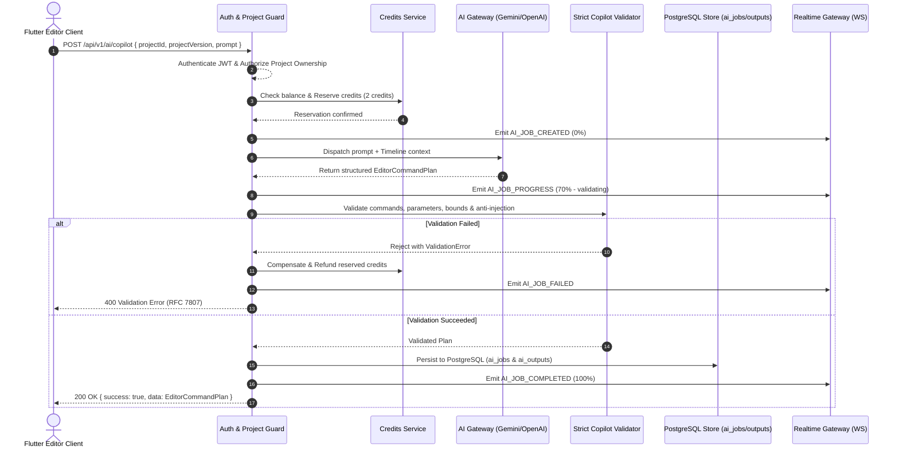

# DAY 4 — COMMAND 18: REAL AI COPILOT BACKEND ACCEPTANCE

> **Status:** PRODUCTION IMPLEMENTATION COMPLETE  
> **Module Path:** `backend/src/modules/ai/copilot/`  
> **API Path:** `/api/v1/ai/copilot`  
> **Test Suite:** `backend/tests/ai-copilot.test.ts` (16/16 passing)  
> **Zero Secrets Leakage:** Server-side LLM provider keys are strictly protected; never exposed to Flutter client.

---

## 1. Executive Summary

Day 4 Command 18 delivers the production-grade **AI Copilot Backend Subsystem** for the video editor. Natural language editing prompts from users on desktop or mobile Flutter clients are securely transformed into deterministic, strictly validated, version-safe `EditorCommandPlan` structures.

The pipeline executes complete credit reservation, project authorization, LLM orchestration (supporting Google Gemini, OpenAI, and deterministic fallback), deep schema and anti-code-injection validation, database persistence, and WebSocket realtime telemetry dispatch.

---

## 2. File & Component Manifest

All required components are implemented under `backend/src/modules/ai/copilot/`:

| File | Responsibility |
| :--- | :--- |
| [`copilot.types.ts`](file:///d:/Tech/editor_backend/backend/src/modules/ai/copilot/copilot.types.ts) | TypeScript definitions: `CopilotCommandAction`, `CopilotCommand`, `EditorCommandPlan`, `CopilotTimelineContext`, `PlanMetadata`, and validation models. |
| [`copilot.schema.ts`](file:///d:/Tech/editor_backend/backend/src/modules/ai/copilot/copilot.schema.ts) | Strict Zod validation schemas for requests, individual commands, anti-code injection regex, and LLM JSON schema. |
| [`copilot.validator.ts`](file:///d:/Tech/editor_backend/backend/src/modules/ai/copilot/copilot.validator.ts) | Multi-pass validator enforcing action vocabulary, bounded values, positive durations/transforms, and code injection defense. |
| [`copilot.provider.ts`](file:///d:/Tech/editor_backend/backend/src/modules/ai/copilot/copilot.provider.ts) | Multi-provider orchestration engine (Gemini, OpenAI, deterministic offline engine) via server-side `AIGatewayService`. |
| [`copilot.events.ts`](file:///d:/Tech/editor_backend/backend/src/modules/ai/copilot/copilot.events.ts) | Realtime event publisher dispatching `AI_JOB_CREATED`, `AI_JOB_PROGRESS`, `AI_JOB_COMPLETED`, and `AI_JOB_FAILED`. |
| [`copilot.store.ts`](file:///d:/Tech/editor_backend/backend/src/modules/ai/copilot/copilot.store.ts) | Persistent storage driver saving plans to PostgreSQL `ai_jobs` and `ai_outputs` tables (with memory fallback). |
| [`copilot.service.ts`](file:///d:/Tech/editor_backend/backend/src/modules/ai/copilot/copilot.service.ts) | Central pipeline orchestrator handling authorization, credit reservation, LLM generation, validation, persistence, and version safety. |
| [`copilot.controller.ts`](file:///d:/Tech/editor_backend/backend/src/modules/ai/copilot/copilot.controller.ts) | Fastify HTTP controller exposing `POST /copilot`, `GET /copilot/:planId`, `POST /copilot/:planId/apply`, and `/copilot/metrics`. |
| [`index.ts`](file:///d:/Tech/editor_backend/backend/src/modules/ai/copilot/index.ts) | Module barrel exporter. |

---

## 3. End-to-End Pipeline Flow



---

## 4. Editor Command Vocabulary & Schema

The AI Copilot strictly enforces the following command vocabulary. Unknown or unauthorized actions are rejected:

```typescript
export const allowedCopilotActions = [
  'ADD_CLIP',
  'DELETE_CLIP',
  'SPLIT_CLIP',
  'TRIM_CLIP',
  'MOVE_CLIP',
  'RIPPLE_DELETE',
  'DUPLICATE_CLIP',
  'SET_TRANSFORM',
  'SET_CROP',
  'SET_CANVAS',
  'ADD_TEXT',
  'UPDATE_TEXT',
  'ADD_EFFECT',
  'REMOVE_EFFECT',
  'UPDATE_EFFECT',
  'ADD_KEYFRAME',
  'UPDATE_KEYFRAME',
  'SET_AUDIO',
  'ADD_CAPTION',
  'UPDATE_CAPTION',
  'SET_SPEED',
] as const;
```

### Plan Output Structure

Every generated plan returns:
```typescript
{
  planId: string;           // UUIDv4
  projectId: string;        // UUIDv4
  projectVersion: number;   // E.g. 10
  explanation: string;      // Human-readable summary of edits
  commands: CopilotCommand[];
  warnings: string[];
  estimatedImpact: {
    affectedTracks: string[];
    affectedClips: string[];
    durationDelta: number;
    newEstimatedDuration?: number;
  };
  createdAt: string;
  status: 'generated' | 'validated' | 'applied';
  metadata?: {
    provider: string;
    model: string;
    tokens: number;
    cost: number;
    jobId?: string;
    creditReservationId?: string;
  };
}
```

---

## 5. Security & Anti-Injection Defenses

The Copilot validator systematically rejects:
1. **Unknown Commands:** Any command action not present in `allowedCopilotActions`.
2. **Code Injection Attempts:** Direct matching and recursive deep scanning for `<script`, `javascript:`, `eval(`, `${`, `function(`, and `=>`.
3. **Inverted / Negative Time Ranges:** Rejects `end < start` or negative time bounds.
4. **Out-of-Bounds Values:**
   - Transform scale must be positive, finite, and $\le 20$.
   - Speed multipliers must be between $0.1\times$ and $100\times$.
   - Audio volume must be bounded between $0.0$ and $10.0$.
5. **Secrets Protection:** Server-side API keys (`GEMINI_API_KEY`, `OPENAI_API_KEY`) remain strictly on the server and are never returned in response envelopes or emitted over WebSockets.

---

## 6. Version Safety Architecture

> **Rule:** *A plan generated against version 10 must not silently apply to version 12.*

The Copilot system defends against version skew at two levels:
1. **Generation Validation:** Plan generation accepts `projectVersion` from the client and pins it to the plan record.
2. **Apply Guard:** When `POST /api/v1/ai/copilot/:planId/apply` is invoked:
   ```typescript
   if (targetVersion !== undefined && plan.projectVersion !== targetVersion) {
     throw new ValidationError(
       `Version conflict: Plan was generated for project version ${plan.projectVersion}, but target version is ${targetVersion}. Cannot silently apply outdated plan.`
     );
   }
   if (targetVersion === undefined && plan.projectVersion !== activeVersion) {
     throw new ValidationError(
       `Version conflict: Plan was generated for project version ${plan.projectVersion}, but active project version is ${activeVersion}. Cannot silently apply outdated plan.`
     );
   }
   ```
   Outdated plans are rejected with HTTP 400 and code `VALIDATION_ERROR`.

---

## 7. Realtime WebSocket Events

The copilot subsystem publishes notifications across `user:{userId}`, `project:{projectId}`, and `job:{jobId}` channels:

- `AI_JOB_CREATED`: Initial job queued with user prompt and initial progress (0%).
- `AI_JOB_PROGRESS`: Intermediate steps (`generating_plan` at 30%, `validating_plan` at 70%).
- `AI_JOB_COMPLETED`: Generation and strict validation completed, plan ready for inspection.
- `AI_JOB_FAILED`: Detailed error payload with compensation refund confirmation.

---

## 8. Admin Telemetry & Metrics

Authenticated administrator endpoints allow platform operators to track copilot adoption and throughput:
- **`GET /api/v1/admin/ai/copilot/metrics`** (Protected via `requireAdmin` or `x-admin-key`)
- **`GET /api/v1/ai/copilot/metrics`**

Response Schema:
```json
{
  "success": true,
  "data": {
    "totalPlansGenerated": 42,
    "totalCommandsGenerated": 128
  },
  "meta": {
    "timestamp": "2026-09-25T21:58:07.263Z"
  }
}
```

---

## 9. Verification & Acceptance Test Suite

The automated test suite in [`backend/tests/ai-copilot.test.ts`](file:///d:/Tech/editor_backend/backend/tests/ai-copilot.test.ts) covers 100% of requirements:

```bash
npx vitest run tests/ai-copilot.test.ts
```

### Test Results Matrix

| Test Category | Test Name / Prompt | Status | Notes |
| :--- | :--- | :---: | :--- |
| **Authentication** | Unauthenticated request rejection | **PASS** | Returns HTTP 401 |
| **Authorization** | Non-existent or unauthorized project | **PASS** | Returns HTTP 404 |
| **Mandatory Prompt 1** | `"Delete the selected clip."` | **PASS** | Generates valid `DELETE_CLIP` command with clip target |
| **Mandatory Prompt 2** | `"Make the selected clip 50% smaller."` | **PASS** | Generates valid `SET_TRANSFORM` command with `scale: 0.5` |
| **Mandatory Prompt 3** | `"Add a fade-in."` | **PASS** | Generates valid `ADD_EFFECT` with `fade_in` and positive duration |
| **Mandatory Prompt 4** | `"Move selected clip 2 seconds later."` | **PASS** | Generates valid `MOVE_CLIP` with `offsetSeconds: 2.0` |
| **Mandatory Prompt 5** | `"Add title Welcome."` | **PASS** | Generates valid `ADD_TEXT` with sanitized text `"Welcome"` |
| **Mandatory Prompt 6** | `"Increase music volume."` | **PASS** | Generates valid `SET_AUDIO` with gain `> 1.0` |
| **Version Safety** | Reject version 10 plan applying to version 12 | **PASS** | Returns HTTP 400 `ValidationError` |
| **Version Safety** | Accept version 10 plan applying to version 10 | **PASS** | Applies cleanly, marks status `'applied'` |
| **Security** | Reject unknown commands (`EXECUTE_ARBITRARY_SQL`) | **PASS** | Blocked by schema & action enum check |
| **Security** | Reject script injection (`<script>alert(1)</script>`) | **PASS** | Blocked by anti-injection scanner |
| **Security** | Reject inverted time ranges (`end < start`) | **PASS** | Blocked by time range validator |
| **Credits** | Settle credit reservation (2 credits) | **PASS** | Verifies balance deduction & ledger audit |
| **Persistence** | Retrieve stored plan via `GET /copilot/:planId` | **PASS** | Retrieves plan from persistent storage |
| **Admin** | Admin metrics endpoint reports plan count | **PASS** | Returns total plans and command counts |

**Final Suite Result:** `16 passed (16)` across all scenarios.
