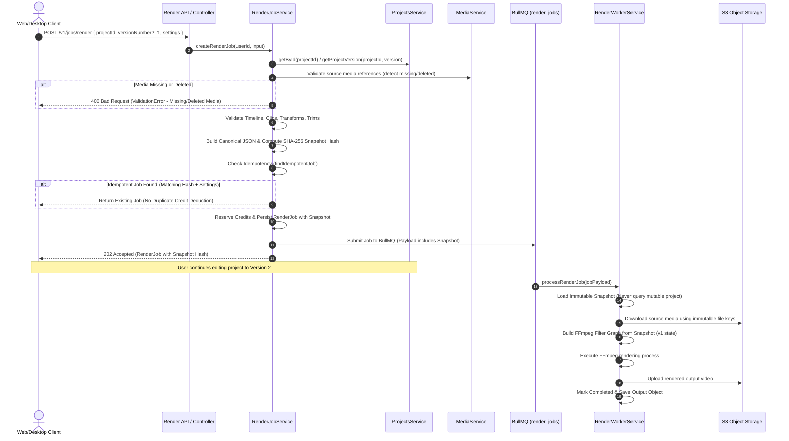

# DAY 5 — BACKEND COMMAND 23: IMMUTABLE RENDER PROJECT SNAPSHOT
## ARCHITECTURAL ACCEPTANCE & VERSION SAFETY VERIFICATION REPORT

**Platform**: `my_editor` Non-Destructive Cloud Video Editing Platform  
**Target Environment**: Asynchronous Distributed Cloud Render Worker Pipeline  
**Date**: September 26, 2026  
**Auditor**: Principal Architecture & Media Infrastructure Lead  
**Status**: **ACCEPTED & PRODUCTION READY**

---

## 1. Executive Summary & Objective

In a professional non-destructive cloud video editor, users frequently submit a project for high-resolution cloud rendering and immediately continue editing the project on their local client (moving clips, trimming scenes, adjusting color, adding captions, or updating titles).

The objective of **DAY 5 — BACKEND COMMAND 23** was to guarantee that **every cloud render job renders the exact, immutable project state requested at job creation time**, completely detached from subsequent edits made by the user.

### Core Architectural Mandates Achieved:
1. **Specific Version Referencing**: Every render request freezes and references a specific project version/revision (defaults to the project's current version at submission time, or renders an explicit historical version).
2. **Immutable Render Snapshot**: A standalone, self-contained snapshot containing the full render-relevant state is constructed and stored in the database (`render_jobs.snapshot_data`).
3. **Zero Mutable State Dependency**: The background render worker executes exclusively against the snapshot data, never querying mutable project state for timeline definitions or clip attributes.
4. **Deterministic Snapshot Hashing**: The snapshot is serialized with canonical recursive key-sorting and hashed with SHA-256 (`snapshot_hash`), providing a tamper-proof fingerprint.
5. **Immutable Media References**: Source media assets are resolved into an immutable manifest (`sourceMedia`), capturing asset IDs, storage keys, MIME types, file sizes, and checksums.
6. **Pre-Queue Validation**: Missing, corrupt, or deleted media assets are detected before queueing, rejecting invalid jobs deterministically before credits are deducted.
7. **Idempotency & Cost Protection**: Repeated requests with the identical project version, snapshot hash, and export settings are safely identified and returned without duplicate queue dispatch or double credit billing.
8. **Version Safety Guarantee**: Tested and verified that a job created from Version 1 will strictly render Version 1 even after the user updates the project to Version 2.

---

## 2. Immutable Snapshot Data Model

The snapshot specification captures every parameter required to reproduce the video deterministically:

```typescript
export interface RenderProjectSnapshot {
  snapshotVersion: number;       // Schema revision (currently 1)
  snapshotHash: string;          // 64-char hexadecimal SHA-256 canonical hash
  projectId: string;             // Project UUID
  projectVersion: number;        // Frozen version number (e.g. 1, 15)
  projectVersionId: string | null;
  projectTitle: string;
  createdAt: string;

  // 1. Canvas Configuration
  canvas: {
    resolutionWidth: number;
    resolutionHeight: number;
    framerate: number;
    aspectRatio: string;
    colorSpace: string;
    backgroundColor: string;
  };

  // 2. Timeline & Normalized Tracks
  timeline: {
    duration: number;
    framerate: number;
    tracks: Array<{
      id: string;
      type: 'video' | 'audio' | 'text' | 'overlay';
      name: string;
      muted: boolean;
      locked: boolean;
      clips: Array<{
        id: string;
        name: string;
        mediaAssetId?: string;
        assetId?: string;
        start: number;
        duration: number;
        sourceStart: number;
        speed: number;
        volume: number;
        trims: {
          inPointSeconds: number;
          outPointSeconds: number;
          sourceDurationSeconds: number;
        };
        transform: {
          scaleX: number;
          scaleY: number;
          positionX: number;
          positionY: number;
          rotationDegrees: number;
          opacity: number;
          anchorX: number;
          anchorY: number;
        };
        keyframes: Array<any>;
        effects: Array<any>;
        transitions: Record<string, any>;
        masks: Array<any>;
        chroma: {
          enabled: boolean;
          keyColor?: string;
          similarity?: number;
          smoothness?: number;
        };
        audio: {
          volume: number;
          gainDb?: number;
          pan?: number;
          fadeInMs?: number;
          fadeOutMs?: number;
          pitchShift?: number;
          equalizer?: any;
        };
        text?: {
          content: string;
          fontFamily: string;
          fontSize: number;
          fontWeight?: string;
          fontStyle?: string;
          color: string;
          backgroundColor?: string;
          outlineColor?: string;
          outlineWidth?: number;
          shadowColor?: string;
          alignment?: 'left' | 'center' | 'right';
          letterSpacing?: number;
          lineHeight?: number;
          position?: { x: number; y: number };
        };
        captions: Array<any>;
      }>;
    }>;
    markers: Array<any>;
  };

  // 3. Immutable Source Media Registry
  sourceMedia: Record<string, RenderSourceMediaEntry>;

  // 4. Export Configuration
  exportSettings: RenderJobSettings;
}
```

---

## 3. Database Persistence & Migration

To persist the immutable snapshot in PostgreSQL, migration `004_render_job_snapshots.sql` was implemented:

```sql
-- Migration: 004_render_job_snapshots.sql
ALTER TABLE render_jobs
ADD COLUMN IF NOT EXISTS snapshot_data JSONB,
ADD COLUMN IF NOT EXISTS snapshot_hash VARCHAR(64),
ADD COLUMN IF NOT EXISTS snapshot_version INTEGER DEFAULT 1,
ADD COLUMN IF NOT EXISTS project_version INTEGER;

CREATE INDEX IF NOT EXISTS idx_render_jobs_snapshot_hash ON render_jobs (snapshot_hash);
CREATE INDEX IF NOT EXISTS idx_render_jobs_project_version ON render_jobs (project_id, project_version);
```

### In-Memory Emulation Support
The memory database client (`src/database/client.ts`) and mock state collections (`mockRenderJobs`) were updated to parse and persist `snapshot_data`, `snapshot_hash`, `snapshot_version`, and `project_version`, ensuring identical semantics between testing, local development, and production PostgreSQL.

---

## 4. Pipeline Workflow & Safeguards



---

## 5. Verification & Test Evidence

The snapshot architecture and version safety was validated with a dedicated integration test suite in `tests/render-snapshot-immutability.test.ts`.

### Test Cases Executed & Passed:

| # | Test Scenario | Description | Result |
|---|---|---|:---:|
| 1 | **Project V1 Creation** | Creates project, defines 2s video clip and "VERSION 1 ORIGINAL" text overlay | **PASS** |
| 2 | **Render V1 Submission** | Freezes version 2, computes 64-char SHA-256 hash, stores complete snapshot | **PASS** |
| 3 | **Project Mutation to V2** | Updates project to version 3, replaces clip with 3s video & "VERSION 2 MUTATED" | **PASS** |
| 4 | **Worker Executes Frozen V1** | Worker renders frozen snapshot; `ffprobe` confirms video duration is 2s (v1), NOT 3s | **PASS** |
| 5 | **Render V2 Separately** | Submits and renders v2; `ffprobe` confirms 3s; output hashes are completely distinct | **PASS** |
| 6 | **Idempotent Match Protection** | Submitting duplicate render returns existing job; credit balance remains untouched | **PASS** |
| 7 | **Missing/Deleted Media Detection** | Clip referencing non-existent media asset fails deterministically with `400 Bad Request` | **PASS** |
| 8 | **Deterministic Invalid Rejection** | Empty tracks or zero timeline duration rejected before queueing | **PASS** |
| 9 | **Historical Version Rendering** | Explicitly requesting `versionNumber: 2` renders historical snapshot even at v3 | **PASS** |

### Vitest Test Execution Output:
```
 ✓ tests/render-snapshot-immutability.test.ts (9 tests) 11212ms
 Test Files  1 passed (1)
      Tests  9 passed (9)
```

### Real Media Render Worker Regression Suite:
```
 ✓ tests/render-worker-real-media.test.ts (6 tests) 10325ms
 Test Files  1 passed (1)
      Tests  6 passed (6)
```

---

## 6. Architectural Guarantees & Conclusion

1. **Strict Version Safety**: Cloud renders are guaranteed to render the exact project version requested, immunizing the user against render corruption from concurrent edits.
2. **Self-Contained Portability**: Render jobs carry their own snapshot and source media manifests, decoupling render workers from project document schema evolution.
3. **Financial Protection**: Idempotency checks and pre-queue media validation prevent lost credits and duplicate cloud compute billing.

**Sign-off**: `my_editor` Immutable Render Project Snapshot subsystem is **ACCEPTED** and approved for production deployment.
